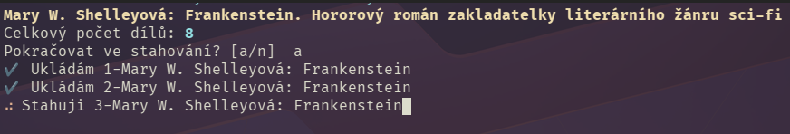

### 🇬🇧 English Summary
# 🐍 CRo-DL (Czech Radio Downloader)
Listen to MůjRozhlas.cz programs offline.

## Overview
CRo-DL is a Python-based 🐍 tool that allows Czech Radio license payers to download and store radio programs locally for offline listening. It supports individual broadcasts, full series, and entire program schedules. Series are saved with episode numbers and user-friendly titles.

⚠️ Respect copyright laws—downloaded content is for personal use only and should not be shared.

## Dependencies
* Python 3.10+ is required.
* Czech Radio mainly uses MP3 and HLS/DASH streams (AAC/M4A).
* FFmpeg is required for handling DASH streams (optional).

## Installation
CRo-DL can be installed via:

### 📦 PyPI

```
pip install cro-dl
```

### 🚀 uv (alternative method)
Download the source code (zip) and sync dependencies:

```
uv sync
uv run cro-dl <url>
```

### 🔧 Git clone (development mode)
```
git clone git@github.com:klimanek/cro-dl.git
uv sync
uv run cro-dl <url>
```
## Usage
1️⃣ Open mujrozhlas.cz, find a broadcast, series, or episode.

2️⃣ Copy the URL from the address bar.

3️⃣ Run in the terminal:

```
cro-dl <url>
```

If multiple formats are available, MP3 is preferred. You can customize the download using the following options:

* `--stream-format` / `-sf`: Specify format (mp3, hls, dash).
* `--title` / `-t`: Set a custom title for the file or folder.
* `--output` / `-o`: Specify a custom output directory.
* `--no-accents`: Remove diacritics from filenames.

Example with custom settings:
```
cro-dl --title "My-Favorite-Show" --no-accents --output "./my-radio" <url>
```


<hr />

### 🇨🇿 Česká verze
# CRo-DL (Český Rozhlas Downloader)
Poslouchejte pořady z MůjRozhlas.cz i offline.

## Popis
CRo-DL je nástroj umožňující každému koncesionáři ČRo stáhnout si pořady Českého rozhlasu lokálně na své zařízení s motivací je poslouchat mimo dosah vln. Dbejte autorských práv a díla stažená pro vlastní potřebu nešiřte dál.

Podporovány jsou jak jednotlivé rozhlasové příspěvky, tak i celé seriály a kompletní programy -- seriály se stahují s číslem dílu a pod svým názvem. Každý titul je uložen do vlastní složky.



Není-li ještě nějaký díl seriálu dostupný, CRo-DL vás upozorní a uvede datum i čas uvedení.

## Závislosti
Software je napsaný v jazyce Python 🐍, proto byste v systému měli mít Python ve verzi alespoň 3.10.

Můjrozhlas.cz v zásadě používá formát mp3 pro svá díla (ČRo) a streamy HLS a DASH pro díla třetích stran. Preferovány jsou formáty mp3 a HLS pro stream. Pokud byste však chtěli z různých důvodů použít DASH, pro vytvoření a uložení finálního souboru je nutné mít v systému nainstalovaný [ffmpeg](https://www.ffmpeg.org/).

Externí balíčky v Pythonu jsou uvedeny ve specifikaci (viz `pyproject.toml`). Při instalaci se stáhnou a nainstalují automaticky.

## Instalace
CRo-DL lze instalovat několika způsoby:

1. PyPi / pip
2. Zip + uv
3. Git clone + uv


### 📦 PyPi
Nejčastěji z PyPi pomocí nástroje `pip`:

```
pip install cro-dl
```

### 🚀  uv
Alternativou je lokální použití CRo-DL pomocí nástroje [uv](https://docs.astral.sh/uv/) poté, co si stáhnete zde zip soubor s codebase.

`uv sync`

Nebo rovnou můžete stáhnout audio soubor z webu s `<url>`

```
uv run cro-dl <url>
```

a všechny závislosti se nainstalují automaticky.


Pro vývoj pak nejlepší bude klonovat zdejší repozitář:

```
git clone git@github.com:klimanek/cro-dl.git
```

## Použití
Otevřete stránku mujrozhlas.cz, najděte si pořad / epizodu / seriál a z adresního řádku zkopírujte aktuální URL. Otevřte terminál a zadejte

```
cro-dl <url>
```

### Pokročilé možnosti stahování
Kromě základního stahování můžete použít následující parametry:

* `--stream-format` / `-sf`: Výběr formátu (mp3, hls, dash).
* `--title` / `-t`: Vlastní název pro soubor nebo složku (vhodné pro přejmenování).
* `--output` / `-o`: Cesta k adresáři, kam se má obsah uložit.
* `--no-accents`: Odstraní diakritiku z názvů souborů a složek.

### Příklad
Chcete-li si pořad stáhnout ve vámi preferovaném formátu, s vlastním názvem a bez diakritiky:

```
cro-dl --title "Můj Pořad" --no-accents --output "./stazeno" https://www.mujrozhlas.cz/leonardo-plus/tuk-da-kazdy-radeji-nez-kostni-dren-endokrinolog-vyviji-novou-lecbu-diabetu-kmenovymi
```
